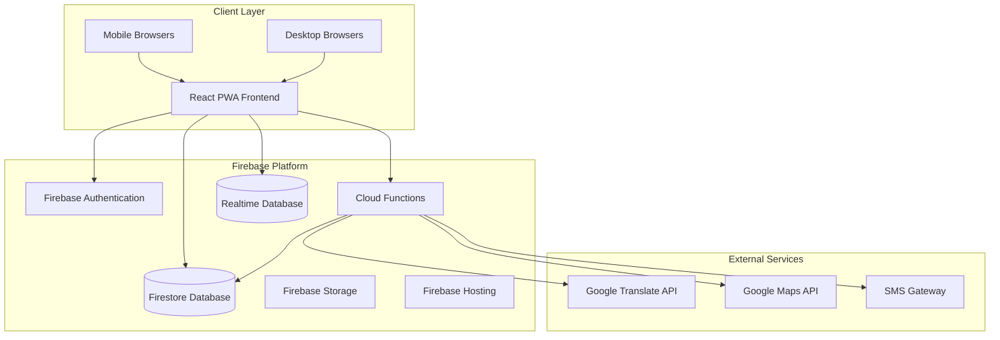
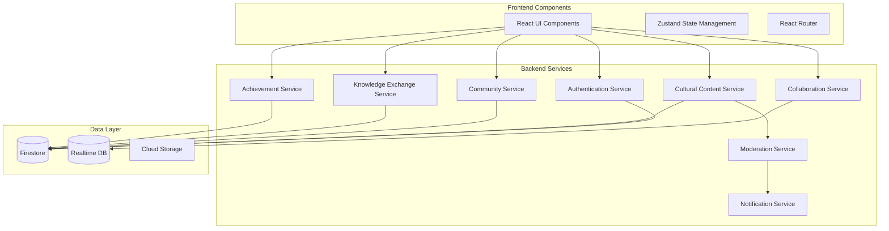
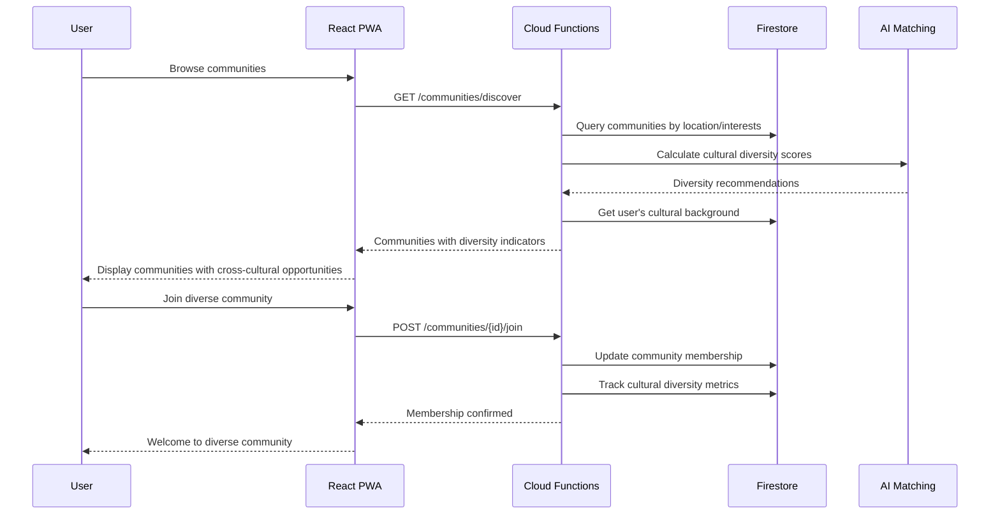

# Ubuntu Connect Architecture Document

## Introduction / Preamble

This document outlines the comprehensive technical architecture for Ubuntu Connect, a culturally sensitive platform designed to unite South Africa through cross-cultural collaboration while celebrating individual heritage. The architecture prioritizes mobile-first design, real-time collaboration, cultural content moderation, and scalability to support 100,000+ concurrent users across 11 official languages.

**Relationship to Frontend Architecture:**
A separate Frontend Architecture Document will detail the React-based Progressive Web App (PWA) design and MUST be used in conjunction with this document. Core technology stack choices documented herein are definitive for the entire project.

## Table of Contents

1. Technical Summary
2. High-Level Overview
3. Architectural / Design Patterns Adopted
4. Component View
5. Project Structure
6. API Reference
7. Data Models
8. Core Workflow / Sequence Diagrams
9. Definitive Tech Stack Selections
10. Infrastructure and Deployment Overview
11. Error Handling Strategy
12. Coding Standards
13. Overall Testing Strategy
14. Security Best Practices

## Technical Summary

Ubuntu Connect employs a serverless microservices architecture using Firebase ecosystem within a monorepo structure. The system combines React 18+ PWA frontend with Firebase Cloud Functions backend, Firestore NoSQL database, and real-time collaboration features. Key architectural decisions prioritize mobile-first performance for South African networks, multi-language support with cultural context preservation, AI-powered content moderation, and scalable cross-cultural matching algorithms.

## High-Level Overview

**Architecture Style:** Serverless Microservices with Event-Driven patterns
**Repository Structure:** Monorepo containing React frontend and Firebase Cloud Functions backend
**Primary Data Flow:** User → PWA → Firebase Auth → Cloud Functions → Firestore → Real-time Updates

The system enables cross-cultural collaboration through location-based, culture-based, and activity-based communities, with real-time translation and cultural sensitivity features integrated throughout.



## Architectural / Design Patterns Adopted

- **Serverless Microservices** - _Rationale:_ Auto-scaling Firebase Cloud Functions enable handling variable loads from cultural events and cross-cultural interactions without infrastructure management
- **Event-Driven Architecture** - _Rationale:_ Real-time cultural interactions, community updates, and cross-cultural matching require immediate event propagation
- **Progressive Web App (PWA)** - _Rationale:_ 79% mobile usage in South Africa requires offline capability and app-like experience without app store dependencies
- **Repository Pattern** - _Rationale:_ Abstraction layer for Firestore operations enables testing and potential future database migrations
- **Command Query Responsibility Segregation (CQRS)** - _Rationale:_ Separate read/write models for cultural content vs. real-time collaboration optimize performance
- **Circuit Breaker Pattern** - _Rationale:_ External API failures (translation, maps) should not break core cultural interaction features

## Component View

**Core Components:**

- **Authentication Service:** Multi-provider authentication with cultural identity management
- **Cultural Content Service:** Community-driven content management with moderation workflows
- **Community Service:** Location, culture, and activity-based community formation and management
- **Knowledge Exchange Service:** Skill-sharing marketplace with time-banking and cross-cultural matching
- **Collaboration Service:** Real-time project coordination with translation and cultural context preservation
- **Achievement Service:** Recognition system for cultural contributions and cross-cultural bridge-building
- **Moderation Service:** AI-powered content filtering with cultural sensitivity and human oversight
- **Notification Service:** Multi-channel notifications (push, email, SMS) with cultural preferences



## Project Structure

```plaintext
ubuntu-connect/
├── .github/                    # CI/CD workflows
│   └── workflows/
│       ├── deploy.yml
│       └── test.yml
├── .vscode/                    # VSCode settings
│   └── settings.json
├── docs/                       # Project documentation
│   ├── project-brief-ubuntu-connect.md
│   ├── ubuntu-connect-prd.md
│   ├── ubuntu-connect-architecture.md
│   └── cultural-guidelines.md
├── firebase/                   # Firebase configuration
│   ├── functions/              # Cloud Functions source
│   │   ├── src/
│   │   │   ├── auth/
│   │   │   ├── cultural/
│   │   │   ├── community/
│   │   │   ├── knowledge/
│   │   │   ├── collaboration/
│   │   │   ├── achievement/
│   │   │   ├── moderation/
│   │   │   └── shared/
│   │   ├── package.json
│   │   └── tsconfig.json
│   ├── firestore.rules
│   ├── storage.rules
│   └── firebase.json
├── src/                        # Frontend application source
│   ├── components/             # React components
│   │   ├── auth/
│   │   ├── cultural/
│   │   ├── community/
│   │   ├── knowledge/
│   │   ├── collaboration/
│   │   ├── achievement/
│   │   └── shared/
│   ├── pages/                  # Page components
│   ├── hooks/                  # Custom React hooks
│   ├── store/                  # Zustand state management
│   ├── services/               # API service layer
│   ├── utils/                  # Utility functions
│   ├── types/                  # TypeScript type definitions
│   ├── assets/                 # Static assets
│   └── App.tsx                 # Main application component
├── public/                     # Public assets
│   ├── manifest.json           # PWA manifest
│   └── sw.js                   # Service worker
├── tests/                      # Test files
│   ├── unit/
│   ├── integration/
│   └── e2e/
├── scripts/                    # Utility scripts
├── .env.example                # Environment variables template
├── package.json                # Project dependencies
├── tsconfig.json               # TypeScript configuration
├── tailwind.config.js          # Tailwind CSS configuration
├── vite.config.ts              # Vite build configuration
└── README.md                   # Project overview
```

### Key Directory Descriptions

- **docs/:** Contains all project planning, architecture, and cultural sensitivity documentation
- **firebase/:** Firebase project configuration including Cloud Functions, security rules, and deployment settings
- **src/:** React PWA source code organized by feature domains matching backend services
- **firebase/functions/src/:** Cloud Functions organized by service domains with shared utilities
- **tests/:** Comprehensive testing including cultural sensitivity and cross-cultural interaction testing

## API Reference

### External APIs Consumed

#### Google Translate API
- **Purpose:** Real-time translation for cross-cultural communication while preserving cultural context
- **Base URL(s):**
  - Production: `https://translation.googleapis.com/language/translate/v2`
  - Staging/Dev: `https://translation.googleapis.com/language/translate/v2`
- **Authentication:** API Key in Header (Header Name: `X-Goog-Api-Key`)
- **Key Endpoints Used:**
  - **`POST /language/translate/v2`:**
    - Description: Translate text between South African languages
    - Request Body Schema: `{ q: string[], source: string, target: string, format: 'text' | 'html' }`
    - Success Response Schema (Code: `200 OK`): `{ data: { translations: [{ translatedText: string, detectedSourceLanguage?: string }] } }`
    - Cultural Context: Custom post-processing to preserve cultural terms and context
- **Rate Limits:** 100 requests per 100 seconds per user
- **Link to Official Docs:** https://cloud.google.com/translate/docs/reference/rest

#### Google Maps API
- **Purpose:** Location-based community matching and cultural site mapping
- **Base URL(s):**
  - Production: `https://maps.googleapis.com/maps/api`
- **Authentication:** API Key in query parameter
- **Key Endpoints Used:**
  - **`GET /geocode/json`:** Geocoding for community location verification
  - **`GET /place/nearbysearch/json`:** Finding nearby cultural sites and communities
- **Rate Limits:** 40,000 requests per month (free tier)

### Internal APIs Provided

#### Cultural Content API
- **Purpose:** Manage community-driven cultural heritage content with moderation
- **Base URL(s):** `/api/v1/cultural`
- **Authentication/Authorization:** Firebase Auth token required, cultural representative permissions for moderation
- **Endpoints:**
  - **`POST /content`:** Submit cultural content for community review
  - **`GET /content/{cultureId}`:** Retrieve approved cultural content by culture
  - **`PUT /content/{contentId}/moderate`:** Cultural representative moderation actions

#### Community API
- **Purpose:** Community formation, discovery, and cross-cultural collaboration
- **Base URL(s):** `/api/v1/communities`
- **Authentication/Authorization:** Firebase Auth token required
- **Endpoints:**
  - **`POST /communities`:** Create new community (location/culture/activity-based)
  - **`GET /communities/discover`:** Discover communities with cross-cultural recommendations
  - **`POST /communities/{id}/join`:** Join community with cultural background tracking

#### Knowledge Exchange API
- **Purpose:** Skill-sharing marketplace with time-banking and cross-cultural matching
- **Base URL(s):** `/api/v1/knowledge`
- **Authentication/Authorization:** Firebase Auth token required
- **Endpoints:**
  - **`POST /skills/offer`:** Offer skills with cultural context and availability
  - **`POST /skills/request`:** Request skills with cross-cultural learning preferences
  - **`GET /matches/{userId}`:** Get skill matches with cultural diversity scoring

## Data Models

### Core Application Entities / Domain Objects

#### User
- **Description:** Platform user with cultural identity, skills, and community connections
- **Schema / Interface Definition:**
  ```typescript
  export interface User {
    id: string; // Firebase Auth UID
    profile: {
      name: string;
      email: string;
      culturalIdentities: string[]; // Multiple cultures allowed
      location?: GeoPoint;
      languages: string[]; // Spoken languages
      bio?: string;
      profileImage?: string;
      joinDate: Timestamp;
      lastActive: Timestamp;
    };
    skills: {
      [skillName: string]: {
        level: 'beginner' | 'intermediate' | 'expert';
        verified: boolean;
        endorsements: number;
        culturalContext?: string; // How skill relates to cultural background
      };
    };
    preferences: {
      notifications: {
        email: boolean;
        push: boolean;
        sms: boolean;
      };
      privacy: {
        profileVisibility: 'public' | 'communities' | 'private';
        locationSharing: boolean;
        culturalIdentityVisible: boolean;
      };
      crossCulturalInteraction: boolean; // Preference for diverse connections
      language: string; // Primary interface language
    };
    achievements: {
      badges: string[];
      points: number;
      contributions: number;
      crossCulturalConnections: number;
    };
  }
  ```
- **Validation Rules:** Email format validation, cultural identities must be from approved list, location within South Africa bounds

#### Community
- **Description:** Groups formed around location, culture, or shared activities with cross-cultural collaboration features
- **Schema / Interface Definition:**
  ```typescript
  export interface Community {
    id: string;
    info: {
      name: string;
      description: string;
      type: 'location' | 'culture' | 'activity' | 'professional';
      culturalFocus?: string[]; // For culture-based communities
      location?: GeoPoint; // For location-based communities
      category?: string; // For activity/professional communities
      isPublic: boolean;
      memberCount: number;
      createdDate: Timestamp;
      guidelines: string[];
      crossCulturalFocus: boolean; // Encourages diverse membership
    };
    members: {
      [userId: string]: {
        role: 'admin' | 'moderator' | 'member';
        joinDate: Timestamp;
        contributionScore: number;
        culturalBackground: string; // For diversity tracking
      };
    };
    settings: {
      autoApproval: boolean;
      skillSharing: boolean;
      eventHosting: boolean;
      culturalExchange: boolean;
    };
    metrics: {
      culturalDiversity: number; // 0-1 score
      crossCulturalInteractions: number;
      activeProjects: number;
    };
  }
  ```
- **Validation Rules:** Name max 100 characters, description max 500 characters, location must be within South Africa for location-based communities

#### CulturalContent
- **Description:** Community-contributed cultural heritage content with moderation and verification
- **Schema / Interface Definition:**
  ```typescript
  export interface CulturalContent {
    id: string;
    culture: string; // Cultural group identifier
    type: 'history' | 'tradition' | 'language' | 'recipe' | 'story' | 'achievement';
    title: string;
    content: string;
    media: {
      images: string[]; // Firebase Storage URLs
      videos: string[];
      audio: string[];
      documents: string[];
    };
    author: {
      userId: string;
      culturalCredibility: 'community_member' | 'cultural_expert' | 'academic';
      verifiedBy?: string; // Cultural representative who verified
    };
    verification: {
      status: 'pending' | 'approved' | 'needs_revision' | 'rejected';
      reviewedBy?: string;
      reviewDate?: Timestamp;
      notes?: string;
      culturalAccuracy: number; // 1-5 rating from cultural representatives
    };
    engagement: {
      views: number;
      likes: number;
      shares: number;
      comments: number;
      crossCulturalViews: number; // Views from other cultural groups
    };
    translations: {
      [languageCode: string]: {
        title: string;
        content: string;
        translatedBy: 'human' | 'ai';
        quality: 'high' | 'medium' | 'low';
        culturalContextPreserved: boolean;
      };
    };
  }
  ```

#### Project
- **Description:** Cross-cultural collaborative projects with diversity tracking and impact measurement
- **Schema / Interface Definition:**
  ```typescript
  export interface Project {
    id: string;
    info: {
      title: string;
      description: string;
      type: 'service' | 'cultural' | 'educational' | 'business';
      status: 'planning' | 'active' | 'completed' | 'cancelled';
      startDate: Timestamp;
      endDate?: Timestamp;
      location?: GeoPoint;
      isVirtual: boolean;
    };
    participants: {
      [userId: string]: {
        role: 'lead' | 'coordinator' | 'participant';
        culturalBackground: string;
        skills: string[];
        joinDate: Timestamp;
        contributions: string[];
        hoursContributed: number;
      };
    };
    requirements: {
      skills: string[];
      culturalDiversity: boolean; // Requires diverse team
      minimumParticipants: number;
      maximumParticipants: number;
      timeCommitment: string;
    };
    resources: {
      budget?: number;
      materials: string[];
      volunteers: number;
      equipment: string[];
    };
    impact: {
      beneficiaries: number;
      culturalGroups: string[]; // Cultures involved/benefited
      successMetrics: {
        [metric: string]: number;
      };
      crossCulturalLearning: string[]; // Learning outcomes
    };
    collaboration: {
      communicationChannels: string[];
      sharedDocuments: string[];
      meetingSchedule: string;
      culturalConsiderations: string[];
    };
  }
  ```

### Database Schemas (Firestore Collections)

#### Users Collection
- **Purpose:** Store user profiles, preferences, and cultural identity information
- **Collection Path:** `/users/{userId}`
- **Security Rules:** Users can read/write their own data, public profiles readable by all authenticated users
- **Indexes:**
  - `culturalIdentities` array-contains for cultural matching
  - `location` geohash for location-based discovery
  - `skills` map keys for skill matching

#### Communities Collection
- **Purpose:** Store community information, membership, and cross-cultural metrics
- **Collection Path:** `/communities/{communityId}`
- **Security Rules:** Public communities readable by all, private communities only by members
- **Indexes:**
  - `type` + `location` for location-based discovery
  - `culturalFocus` array-contains for culture-based discovery
  - `crossCulturalFocus` for diversity-focused communities

#### Cultural Content Collection
- **Purpose:** Store cultural heritage content with moderation workflow
- **Collection Path:** `/culturalContent/{contentId}`
- **Security Rules:** Approved content readable by all, pending content only by author and moderators
- **Indexes:**
  - `culture` + `verification.status` for content discovery
  - `type` + `culture` for categorized browsing
  - `engagement.crossCulturalViews` for popular cross-cultural content

## Core Workflow / Sequence Diagrams

### Cross-Cultural Community Discovery Flow



### Cultural Content Moderation Flow

```mermaid
sequenceDiagram
    participant U as User
    participant PWA as React PWA
    participant CF as Cloud Functions
    participant AI as AI Moderation
    participant CR as Cultural Representative
    participant FS as Firestore

    U->>PWA: Submit cultural content
    PWA->>CF: POST /cultural/content
    CF->>AI: AI content analysis
    AI-->>CF: Safety + cultural sensitivity check

    alt Content passes AI checks
        CF->>FS: Store with status 'pending'
        CF->>CR: Notify cultural representative
        CR->>PWA: Review content for accuracy
        CR->>CF: Approve/request revision
        CF->>FS: Update verification status
        CF-->>U: Content approved notification
    else Content fails AI checks
        CF-->>PWA: Content rejected with feedback
        PWA-->>U: Revision suggestions
    end

## Definitive Tech Stack Selections

| Category             | Technology              | Version / Details | Description / Purpose                   | Justification |
| :------------------- | :---------------------- | :---------------- | :-------------------------------------- | :------------ |
| **Languages**        | TypeScript              | 5.3+              | Primary language for frontend/backend   | Type safety, cultural data modeling |
| **Runtime**          | Node.js                 | 20.x              | Server-side execution environment       | Firebase Functions compatibility |
| **Frontend Framework** | React                 | 18.2+             | UI library for PWA                      | Component reusability, PWA support |
| **Backend Platform** | Firebase Cloud Functions | Latest           | Serverless backend functions            | Auto-scaling, real-time features |
| **Database**         | Firestore               | Latest            | NoSQL database with real-time sync      | Offline support, real-time collaboration |
| **Real-time DB**     | Firebase Realtime DB    | Latest            | Live messaging and collaboration        | Sub-second latency for chat |
| **Authentication**   | Firebase Auth           | Latest            | Multi-provider authentication           | Social login, phone verification |
| **Storage**          | Firebase Storage        | Latest            | Media and document storage              | CDN integration, security rules |
| **Hosting**          | Firebase Hosting        | Latest            | PWA hosting with CDN                    | Global CDN, HTTPS by default |
| **Build Tool**       | Vite                    | 5.x               | Fast build tool and dev server          | Fast HMR, optimized builds |
| **CSS Framework**    | Tailwind CSS            | 3.4+              | Utility-first CSS framework            | Responsive design, customization |
| **State Management** | Zustand                 | 4.x               | Lightweight state management            | Simple API, TypeScript support |
| **Routing**          | React Router            | 6.x               | Client-side routing                     | PWA navigation, code splitting |
| **UI Components**    | Headless UI             | 1.x               | Unstyled accessible components          | Accessibility, custom styling |
| **Icons**            | Lucide React            | Latest            | Icon library                            | Consistent iconography |
| **Translation**      | Google Translate API    | v2                | Real-time translation service           | Multi-language support |
| **Maps**             | Google Maps API         | v3                | Location services and mapping           | Community location features |
| **Testing Framework** | Vitest                 | 1.x               | Unit testing framework                  | Vite integration, fast execution |
| **E2E Testing**      | Playwright              | 1.x               | End-to-end testing                      | Cross-browser testing |
| **Linting**          | ESLint                  | 8.x               | Code linting and formatting             | Code quality, consistency |
| **Formatting**       | Prettier                | 3.x               | Code formatting                         | Consistent code style |
| **CI/CD**            | GitHub Actions          | N/A               | Continuous integration/deployment       | Firebase deployment integration |

## Infrastructure and Deployment Overview

- **Cloud Provider:** Google Cloud Platform (Firebase ecosystem)
- **Core Services Used:** Firebase Hosting, Cloud Functions, Firestore, Realtime Database, Authentication, Storage, Cloud Messaging
- **Infrastructure as Code:** Firebase CLI configuration files (firebase.json, firestore.rules, storage.rules)
- **Deployment Strategy:** Automated CI/CD pipeline with cultural content review gates
- **Environments:** Development (local Firebase emulators), Staging (Firebase project), Production (Firebase project)
- **Environment Promotion:** `dev` → `staging` (automated on main branch) → `production` (manual approval after cultural review)
- **Rollback Strategy:** Firebase Hosting rollback via CLI, Cloud Functions automatic rollback on health check failure

## Error Handling Strategy

- **General Approach:** Use custom error classes extending base `AppError` for domain-specific errors with cultural context
- **Logging:**
  - Library/Method: Structured logging with Firebase Functions logger and custom correlation IDs
  - Format: JSON with timestamp, severity, correlation ID, user ID (anonymized), cultural context
  - Levels: DEBUG, INFO, WARN, ERROR, CRITICAL with cultural sensitivity flags
  - Context: Correlation ID, anonymized user ID, cultural interaction type, service name, operation name
- **Specific Handling Patterns:**
  - External API Calls: Exponential backoff with max 3 retries, circuit breaker for translation services, 30s timeout
  - Cultural Content Errors: Preserve cultural context in error messages, escalate to cultural representatives
  - Real-time Collaboration: Graceful degradation when real-time features fail, offline queue for messages
  - Translation Failures: Fallback to original language with notification, preserve cultural terms

## Coding Standards

**Primary Runtime:** Node.js 20.x for Cloud Functions, modern browsers for PWA
**Style Guide & Linter:** ESLint with TypeScript strict rules + Prettier formatting
**Naming Conventions:**
- Variables: `camelCase`
- Functions/Methods: `camelCase`
- Classes/Types/Interfaces: `PascalCase`
- Constants: `UPPER_SNAKE_CASE`
- Files: `kebab-case.ts` for components, `camelCase.ts` for utilities
- Cultural Content: Preserve original cultural terms in code comments

**File Structure:** Adhere to project structure with feature-based organization
**Unit Test File Organization:** `*.test.ts` co-located with source files
**Asynchronous Operations:** Always use `async`/`await` for Firebase operations
**Type Safety:** TypeScript strict mode enabled, no `any` types without justification
**Cultural Considerations:** All user-facing strings must support internationalization, cultural terms preserved in original language with translations

### Detailed Language & Framework Conventions

#### TypeScript/React Specifics:
- **Immutability:** Use `Readonly<T>` for props, `as const` for cultural data arrays
- **Functional vs. OOP:** Favor functional components and hooks, use classes only for error boundaries
- **Error Handling Specifics:** Custom error classes for cultural content errors, Firebase error wrapping
- **Cultural Data Handling:** Preserve original cultural terms, use type-safe cultural identifiers
- **Firebase Integration:** Use Firebase v9 modular SDK, implement proper offline handling
- **PWA Requirements:** Service worker for offline cultural content, background sync for community updates

## Overall Testing Strategy

**Tools:** Vitest for unit tests, Playwright for E2E tests, Firebase Emulator Suite for integration tests
**Unit Tests:**
- **Scope:** Test individual components, hooks, and utility functions with cultural data scenarios
- **Location:** `*.test.ts` co-located with source files
- **Mocking/Stubbing:** Mock Firebase services, external APIs, and cultural content data
- **AI Agent Responsibility:** Generate tests for all cultural interaction logic, cross-cultural matching algorithms, and content moderation workflows

**Integration Tests:**
- **Scope:** Test Firebase Functions with Firestore, cultural content workflows, real-time collaboration
- **Location:** `/tests/integration`
- **Environment:** Firebase Emulator Suite with test cultural data
- **Cultural Testing:** Verify cultural content moderation, cross-cultural matching accuracy, translation preservation

**End-to-End Tests:**
- **Scope:** Complete user journeys including cross-cultural interactions, community joining, content submission
- **Tools:** Playwright with mobile device simulation
- **Cultural Scenarios:** Test multi-language interfaces, cultural content discovery, cross-cultural project collaboration

**Test Coverage:** 80% line coverage target with emphasis on cultural interaction logic quality
**Cultural Test Data:** Comprehensive test datasets representing all 11 South African cultural groups

## Security Best Practices

**Input Sanitization/Validation:**
- Use Zod schemas for all API inputs with cultural content validation
- Validate cultural identifiers against approved lists
- Sanitize user-generated cultural content while preserving cultural terms

**Output Encoding:**
- React automatically escapes JSX content
- Preserve cultural characters and diacritics in all text processing
- Use DOMPurify for rich cultural content with allowlisted cultural formatting

**Secrets Management:**
- Firebase project configuration via environment variables
- API keys stored in Firebase Functions config
- Cultural representative credentials managed through Firebase Auth custom claims

**Dependency Security:**
- Automated vulnerability scanning via GitHub Dependabot
- Regular updates with cultural content compatibility testing
- Audit cultural content processing libraries for security

**Authentication/Authorization Checks:**
- Firebase Auth tokens required for all protected endpoints
- Cultural representative permissions via custom claims
- Community-based authorization for cultural content moderation

**Cultural Content Security:**
- AI-powered content moderation for cultural sensitivity
- Cultural representative approval workflow for heritage content
- Prevent cultural appropriation through community verification
- Preserve cultural context in all security logging

**API Security:**
- HTTPS enforced via Firebase Hosting
- Rate limiting on cultural content submission
- CORS configured for cultural site embedding
- Cultural data anonymization in error logs

**Privacy & Cultural Sensitivity:**
- Optional cultural identity disclosure
- Granular privacy controls for cultural information
- Cultural data portability and deletion rights
- Anonymized cultural interaction analytics

## Key Reference Documents

- Project Brief: Ubuntu Connect - South African Cultural Unity Platform
- Ubuntu Connect PRD (Product Requirements Document)
- Cultural Sensitivity Guidelines (to be developed with cultural representatives)
- Firebase Security Rules Documentation
- South African POPIA Compliance Framework

## Change Log

| Change | Date | Version | Description | Author |
| ------ | ---- | ------- | ----------- | ------ |
| Initial Architecture | 2024-12-19 | 1.0 | Comprehensive architecture for Ubuntu Connect | Timmy (Architect) |

--- Below, Prompt for Design Architect (Frontend Architecture) ----

## Prompt for Design Architect (Frontend Architecture Mode)

**Objective:** Create detailed frontend architecture for Ubuntu Connect's React PWA with emphasis on cultural sensitivity, mobile-first design, and cross-cultural collaboration features.

**Mode:** Frontend Architecture Mode

**Input:** This completed Architecture Document and the Ubuntu Connect PRD

**Key Tasks:**

1. **Cultural UI/UX Architecture:** Design component architecture that respects all South African cultures while promoting unity through visual metaphors (constellation, tapestry, bridge themes)

2. **Mobile-First PWA Architecture:** Define Progressive Web App architecture optimized for South African mobile networks with offline cultural content capabilities

3. **Real-time Collaboration Architecture:** Design frontend architecture for real-time cross-cultural communication with translation integration and cultural context preservation

4. **Cultural Content Management:** Create frontend architecture for community-driven cultural content with moderation workflows and cultural representative interfaces

5. **Cross-Cultural Interaction Design:** Define component architecture for cultural discovery, community formation, and knowledge exchange with diversity encouragement

6. **Accessibility & Multi-language:** Ensure frontend architecture supports WCAG 2.1 AA compliance and seamless switching between 11 South African languages

7. **State Management for Cultural Data:** Design Zustand store architecture for cultural identities, community memberships, and cross-cultural interactions

8. **Performance Optimization:** Define code splitting, lazy loading, and caching strategies for cultural content and real-time features on mobile networks

Please create a comprehensive Frontend Architecture Document that complements this backend architecture and enables the development of a culturally sensitive, performant, and accessible platform for South African unity.
```
